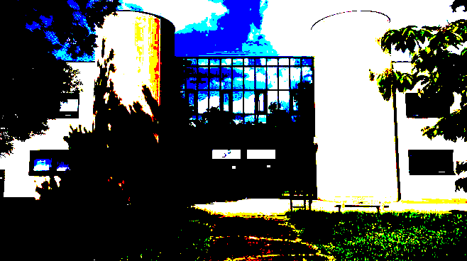
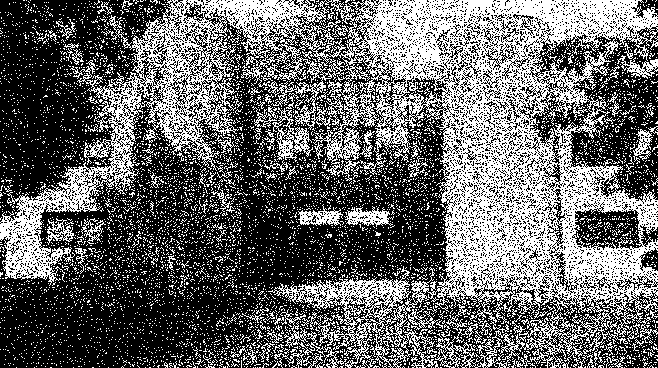
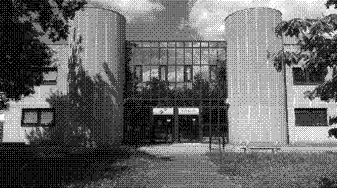

# TP de Programmation Avancée : Ditherpunk: retour au monochrome

## Présentation du projet : 

L'objectif de ce tp est de s'entrainer à manipuler des images en utilisant la bibliothèque image en Rust. 

## Membre du groupe : 

- Liam Sottier 
- Romain Mechain 

## Question 1 :

Pour créer un nouveau projet cargo il suffit de faire la commande suivante `cargo init tp_note_rust` dans le terminal.

Ensuite il suffit de se rendre dans le dossier créé et d'ajouter la dépendance suivante dans le fichier `Cargo.toml` : 

```toml
[dependencies]
argh = "0.1.13"
image = "0.24.9"
```

## Questions 2 : 

Le type DynamicImage représente une image sous forme de matrice de pixels, chacun sous la forme RGBA. 

Pour obtenir une image sous forme RGB8 il nous suffit d'utiliser la fonction to_rgb8() sur notre image. Nous avons donc le code suivant : 

```rust
let img_path = "iut.jpg";
let img = image::open(img_path)?;
let rgb_img = img.to_rgb8();
rgb_img.save("output_rgb8.png")?;
```

Nous avons l'image suivante :


## Questions 3 :

Si nous utilisons cette méthode sur une image avec un canal alpha, puis que nous l'exportons en PNG, le canal alpha sera perdu.

## Question 4 : 

IL est possible de récupérer un pixel avec la commande `img.get_pixel(x, y)`. Nous avons le code suivant pour l'afficher 

```rust
let pixel32_52 = rgb_img.get_pixel(32, 52);
println!("Pixel (32, 52) : {:?}", pixel32_52);
```

## Question 5 : 

Pour changer la couleur d'un pixel sur deux, il suffit de les parcourir et de modifier ceux dont la ligne plus la colonne sont paire. Nous avons donc le code et le résultat suivant : 

```rust
rgb_img.enumerate_pixels_mut().for_each(|(x, y, pixel)| {
    if (x + y) % 2 == 0 {
        *pixel = image::Rgb([255, 255, 255]);
    }
});
rgb_img.save("../images/Question5.png")?;
```


## Question 6 :

Il est possible de définir la luminosité d'un pixel à partire de son code rgb, on utilise pour cela la formule `0.2126 * rouge + 0.7152 * vert + 0.0722 * bleu`. 

## Question 7 :

Pour implémenter cette méthode, nous avons le code suivant : 

```rust
fn calcule_luminosité(pixel: image::Rgb<u8>) -> f32 {
    let r = pixel[0] as f32;
    let g = pixel[1] as f32;
    let b = pixel[2] as f32;
    0.2126 * r + 0.7152 * g + 0.0722 * b
}
```

Nous pouvons donc le tester sur le pixel (32, 52) : 

```rust
let luminosité = calcule_luminosité(*pixel32_52);
println!("Luminosité du pixel (32, 52) : {}", luminosité);
```

Enfin, pour implémenter le traitement sur l'image, on peut utiliser le code suivant : 

```rust
rgb_img.enumerate_pixels_mut().for_each(|(_x, _y, pixel)| {
    let luminosité = calcule_luminosité(*pixel);
    if luminosité > 128.0 {
        *pixel = image::Rgb([255, 255, 255]);
    } else {
        *pixel = image::Rgb([0, 0, 0]);
    }
});
rgb_img.save("../images/Question7.png")?;
```

Nous obtenons donc l'image suivante :


## Question 8 :

A partir de cette étape, nous allons utiliser la bibliothèque argh pour pouvoir appeler les différents fonction de notre programme directement en ligne de commande avec les arguments que l'on souhaite. Cela était nécessaire pour pouvoir laisser le choix des couleurs à l'utilisateur. 

Pour permettre à l'utilisateur de choisir ses couleurs, plutôt que d'avoir l'image en seuil de noir et blanc, nous avons créé deux nouveaux arguments, color1 et color2 : 
```rust
struct DitherArgs {

    /// le fichier d’entrée
    #[argh(positional)]
    input: String,

    /// le fichier de sortie (optionnel)
    #[argh(positional)]
    output: Option<String>,

    /// la premiere couleur
    #[argh(option)]
    color1: String,

    /// la seconde couleur
    #[argh(option)]
    color2: String,

    /// le mode d’opération
    #[argh(subcommand)]
    mode: Mode

    
}
```

Que l'on va chercher ensuite dans le main : 

```rust
fn main() -> Result<(), ImageError> {
    let args: DitherArgs = argh::from_env();
    if !std::path::Path::new(&args.input).exists() {
        eprintln!("Erreur : Le fichier d'entrée '{}' n'existe pas.", args.input);
        std::process::exit(1);
    }

    let img = image::open(&args.input)?;
    let mut rgb_img = img.to_rgb8();
   

    // exercice 8
    let color1 = hex_to_rgb(&args.color1).expect("Première couleur invalide");
    let color2 = hex_to_rgb(&args.color2).expect("Deuxième couleur invalide");

    let img = image::open(&args.input)?;
    let mut rgb_img = img.to_rgb8();

    rgb_img.enumerate_pixels_mut().for_each(|(_x, _y, pixel)| {
        let luminosité = calcule_luminosité(*pixel);
        if luminosité > 128.0 {
            *pixel = color1;
        } else {
            *pixel = color2;
        }
    });

    
    rgb_img.save("../images/Question8.png")?;
    Ok(())
}
```
Ici on récupère les couleurs en arguments, qui sont en hexadécimal et on les convertis en RGB avec cette fonction : 
```rust
fn hex_to_rgb(hex: &str) -> Result<Rgb<u8>, String> {
    
    if hex.len() != 6 {
        return Err(format!("La couleur '{}' n'est pas valide. Utilisez le format #RRGGBB.", hex));
    }
    let r = u8::from_str_radix(&hex[0..2], 16).map_err(|_| "Composante rouge invalide")?;
    let g = u8::from_str_radix(&hex[2..4], 16).map_err(|_| "Composante verte invalide")?;
    let b = u8::from_str_radix(&hex[4..6], 16).map_err(|_| "Composante bleue invalide")?;
    Ok(Rgb([r, g, b]))
}
```
Voici un exemple de ligne de commande pour pouvoir executer :
```
cargo run -- iut.jpg --color1 00ff00 --color2 0000ff seuil
```
Ce qui nous donne cette image : 


## Question 9 :

Pour calculer la distance entre deux couleurs on a décider de prendre les valeurs RGB des deux pixels, puis de calculer la différence entre les valeurs de rouge, vert et bleu, et de finir par calculer la racine carré de la somme des carrés de ces trois valeurs. Ce qui nous donne cette fonction : 
```rust
fn calcule_distance_couleur(pixel1: Rgb<u8>, pixel2: Rgb<u8>) -> f32 {
    let r_diff = pixel1[0] as f32 - pixel2[0] as f32;
    let g_diff = pixel1[1] as f32 - pixel2[1] as f32;
    let b_diff = pixel1[2] as f32 - pixel2[2] as f32;
    (r_diff * r_diff + g_diff * g_diff + b_diff * b_diff).sqrt()
}
```

## Question 10 :

Pour faire ce traitement nous avons, tout d'abord, défini une palette de couleur, et nous demandons à l'utilisateur de fournir le nombre de couleurs qu'il souhaite. Ensuite on vérifie que le nombre de couleurs renseigné est bien valide, si c'est le cas on créer une palette avec le nombre de couleur correspondant. Ensuite pour chaque pixel de l'image on regarde la couleur, de la palette, la plus proche et on modifie le pixel en conséquence. 

```rust
Mode::Palette(opts) => {
            let couleurs = vec![
                Rgb([0, 0, 0]),       // Noir
                Rgb([255, 255, 255]), // Blanc
                Rgb([255, 0, 0]),     // Rouge
                Rgb([0, 255, 0]),     // Vert
                Rgb([0, 0, 255]),     // Bleu
                Rgb([255, 255, 0]),   // Jaune
                Rgb([0, 255, 255]),   // Cyan
                Rgb([255, 0, 255]),   // Magenta
            ];

            if opts.n_couleurs == 0 || opts.n_couleurs > couleurs.len() {
                eprintln!(
                    "Erreur : Le nombre de couleurs doit être entre 1 et {}.",
                    couleurs.len()
                );
                std::process::exit(1);
            }

            let palette = &couleurs[..opts.n_couleurs];

            rgb_img.enumerate_pixels_mut().for_each(|(_x, _y, pixel)| {
                let mut meilleure_distance = f32::MAX;
                let mut meilleure_couleur = palette[0];

                for &couleur in palette {
                    let distance = calcule_distance_couleur(*pixel, couleur);
                    if distance < meilleure_distance {
                        meilleure_distance = distance;
                        meilleure_couleur = couleur;
                    }
                }

                *pixel = meilleure_couleur;
            });
        }
```

Voici une ligne de commande qui permet d'executer le mode palette : 

```
cargo run -- iut.jpg palette --n-couleurs 8
```

Ce qui donne cette image : 



## Question 11 : 

Pour gérer ce comportement nous avons ajouter un message d'erreur si jamais le nombre de couleur spécifié est invalide, ici si il n'est pas entre 1 et 8 : 


Ainsi si le nombre de couleur est invalide on sort de la fonction et on arrête le traitement de l'image :

```rust
 if opts.n_couleurs == 0 || opts.n_couleurs > couleurs.len() {
    eprintln!(
        "Erreur : Le nombre de couleurs doit être entre 1 et {}.",
        couleurs.len()
    );
    std::process::exit(1);
}
```
## Question 12 : 

Le tramage par seuil aléatoire n'est pas très compliqué à implémenté, en effet, il suffit de reprendre le code de la question 8, et de rajouter une condition pour choisir aléatoirement le seuil à chaque pixel. 

Nous commençons donc par rajouter les structures nécessaire pour le argh : 

```rust
#[derive(Debug, Clone, PartialEq, FromArgs)]
#[argh(subcommand)]
enum Mode {
    Seuil(OptsSeuil),
    Palette(OptsPalette),
    Tramage(OptsTramage),
}

#[derive(Debug, Clone, PartialEq, FromArgs)]
#[argh(subcommand, name="tramage")]
/// Rendu de l’image par tramage
struct OptsTramage {}
```

Enfin, dans le main on rajoute le cas ou le mode est tramage, en rajoute le code de la question 8, avec un appel à la bibliothèque rand préalablement ajouté pour choisir aléatoirement le seuil : 

```rust
Mode::Tramage(opts) => {
    let mut rng = rand::thread_rng();
    let mut seuil = 128.0;
    rgb_img.enumerate_pixels_mut().for_each(|(_x, _y, pixel)| {
        let luminosité = calcule_luminosité(*pixel);
        seuil = rng.gen_range(0.0..255.0);
        if luminosité > seuil {
            *pixel = image::Rgb([255, 255, 255]);
        } else {
            *pixel = image::Rgb([0, 0, 0]);
        }
    });
}
```

Ainsi avec la commande suivante `cargo run -- iut.jpg tramage` on obtient l'image suivante :



## Question 13 :

Voici à quoi ressemble une matrice de bayer d'ordre 3 : 

```
[0, 32, 8, 40, 2, 34, 10, 42],
[48, 16, 56, 24, 50, 18, 58, 26], 
[12, 44, 4, 36, 14, 46, 6, 38], 
[60, 28, 52, 20, 62, 30, 54, 22],
[3, 35, 11, 43, 1, 33, 9, 41],
[51, 19, 59, 27, 49, 17, 57, 25],
[15, 47, 7, 39, 13, 45, 5, 37],
[63, 31, 55, 23, 61, 29, 53, 21],
```

## Question 14 :
 
Pour représenter une matrice de Bayer nous pouvons utiliser une liste de liste. Pour en générer une de taille n, il suffit de faire une fonction recursive, qui a chaque étape recréer une liste 2 fois plus grande que la précedente et ajoute les nouvelles valeurs. Voici notre fonction : 

```rust
fn generation_matrice_bayer(ordre: usize) -> Vec<Vec<u32>> {
        if ordre == 0 {
            return vec![vec![0]];
        }

        let matrice_ordre_precedent = generation_matrice_bayer(ordre - 1);
        let taille = matrice_ordre_precedent.len();
        let mut matrice = vec![vec![0; taille * 2]; taille * 2];

        for i in 0..taille {
            for j in 0..taille {
                let valeur = matrice_ordre_precedent[i][j];
                matrice[i][j] = 4 * valeur;
                matrice[i + taille][j] = 4 * valeur + 2;
                matrice[i][j + taille] = 4 * valeur + 3;
                matrice[i + taille][j + taille] = 4 * valeur + 1;
            }
        }

        return matrice;
    }
```

Cette fonction prend en paramètre l'ordre de la matrice de Bayer que l'on souhaite générer, et retourne une liste de liste de u32.

## Question 15 :

Comme pour la question 12, nous avons rajouté une structure pour le argh : 

```rust
#[derive(Debug, Clone, PartialEq, FromArgs)]
#[argh(subcommand)]
enum Mode {
    Seuil(OptsSeuil),
    Palette(OptsPalette),
    Tramage(OptsTramage),
    Bayer(OptsBayer),
}

#[derive(Debug, Clone, PartialEq, FromArgs)]
#[argh(subcommand, name="bayer")]
/// Rendu de l’image par tramage d’ordre n
struct OptsBayer {
    /// l’ordre de la matrice de Bayer
    #[argh(option)]
    ordre: usize
}
```
Puis en suite, dans le main nous avons rajouté le cas ou l'utilisateur choisi le mode bayer, et nous avons rajouté le code suivant : 

```rust
Mode::Bayer(opts) => {
    let matrice_bayer = generation_matrice_bayer(opts.ordre);
    let taille = matrice_bayer.len();
    rgb_img.enumerate_pixels_mut().for_each(|(x, y, pixel)| {
        let luminosité = calcule_luminosité(*pixel);
        let valeur = matrice_bayer[(x % taille as u32) as usize][(y % taille as u32) as usize] as f32;
        if luminosité > valeur {
            *pixel = image::Rgb([255, 255, 255]);
        } else {
            *pixel = image::Rgb([0, 0, 0]);
        }
    });
} 
```
Dans ce code, nous récupérons la matrice de bayeur de l'ordre spécifié par l'utilisateur, puis, pour chaque pixel, nous récupéron la valeur de la matrice de Bayer correspondant, en faisant ses coordonnées modulo la taille de la matrice. Ensuite, si la luminosité du pixel est supérieur à la valeur de la matrice de Bayer, nous mettons le pixel en blanc, sinon en noir.

Ainsi avec la commande suivante `cargo run -- iut.jpg bayer --ordre 4` on obtient l'image suivante :



## Question 16 : 

Pour cette question, nous n'avons pas réussi à implémenter la diffusion d'erreur avec une matrice sur une image monochrome. voici cependant le code que nous avons essayé d'implémenter : 

```rust
Mode::DiffusionMono(opts) => {
    let largeur = rgb_img.width();
    let hauteur = rgb_img.height();
    rgb_img.enumerate_pixels_mut().for_each(|(x, y, pixel)| {
        let luminosité = calcule_luminosité(*pixel);
        let mut erreur = 0.0;
        let mut blanc = true;
        if luminosité > 128.0 {
            *pixel = image::Rgb([255, 255, 255]);
            erreur = 255.0 - luminosité;
        } else {
            *pixel = image::Rgb([0, 0, 0]);
            erreur = luminosité;
            blanc = false;
        }
        // Ajout de l'erreur sur le pixel de droite 
        if x + 1 < largeur {
            let pixel_droite = rgb_img.get_pixel(x + 1, y);
            if blanc {
                let r = pixel_droite[0] as f32 + erreur * 0.5;
                let g = pixel_droite[1] as f32 + erreur * 0.5;
                let b = pixel_droite[2] as f32 + erreur * 0.5;
                rgb_img.put_pixel(x + 1, y, image::Rgb([r as u8, g as u8, b as u8]));
            } else {
                let r = pixel_droite[0] as f32 - erreur * 0.5;
                let g = pixel_droite[1] as f32 - erreur * 0.5;
                let b = pixel_droite[2] as f32 - erreur * 0.5;
                rgb_img.put_pixel(x + 1, y, image::Rgb([r as u8, g as u8, b as u8]));
            }
        }
        // Ajout de l'erreur sur le pixel en bas
        if y + 1 < hauteur {
            let pixel_bas = rgb_img.get_pixel(x, y + 1);
            if blanc {
                let r = pixel_bas[0] as f32 + erreur * 0.5;
                let g = pixel_bas[1] as f32 + erreur * 0.5;
                let b = pixel_bas[2] as f32 + erreur * 0.5;
                rgb_img.put_pixel(x, y + 1, image::Rgb([r as u8, g as u8, b as u8]));
            } else {
                let r = pixel_bas[0] as f32 - erreur * 0.5;
                let g = pixel_bas[1] as f32 - erreur * 0.5;
                let b = pixel_bas[2] as f32 - erreur * 0.5;
                rgb_img.put_pixel(x, y + 1, image::Rgb([r as u8, g as u8, b as u8]));
            }
        }
    });
}
```

Ce code n'étant pas fonctionnel, et provoquant des erreurs, nous l'avons laisser en commentaire dans le code final.

## Question 21 :

Lorsque l'on effectue la commande `cargo run -- --help` nous obtenons l'affichage d'aide suivant : 


## question 22 :

Le type Rust correspondant à une selection d'options fournis par l'utilisateur est une structure (Struct) DitherArgs, que nous avons implémenté de la manière suivante : 

```rust

#[derive(Debug, Clone, PartialEq, FromArgs)]
/// Convertit une image en monochrome ou vers une palette réduite de couleurs.
struct DitherArgs {

    /// le fichier d’entrée
    #[argh(positional)]
    input: String,

    /// le fichier de sortie (optionnel)
    #[argh(positional)]
    output: Option<String>,

    /// la premiere couleur
    #[argh(option, default = "String::from(\"FFFFFF\")")]
    color1: String,

    /// la seconde couleur
    #[argh(option, default = "String::from(\"000000\")")]
    color2: String,

    /// le mode d’opération
    #[argh(subcommand)]
    mode: Mode

    
}
```

## Question 23 : 

Pour implémenter notre interface en ligne de commande, nous avons d'abord ajouter les options dans la Struct DitherArgs, puis les differents modes avec l'Enum Mode : 

```rust
#[derive(Debug, Clone, PartialEq, FromArgs)]
/// Convertit une image en monochrome ou vers une palette réduite de couleurs.
struct DitherArgs {

    /// le fichier d’entrée
    #[argh(positional)]
    input: String,

    /// le fichier de sortie (optionnel)
    #[argh(positional)]
    output: Option<String>,

    /// la premiere couleur
    #[argh(option, default = "String::from(\"FFFFFF\")")]
    color1: String,

    /// la seconde couleur
    #[argh(option, default = "String::from(\"000000\")")]
    color2: String,

    /// le mode d’opération
    #[argh(subcommand)]
    mode: Mode

    
}

#[derive(Debug, Clone, PartialEq, FromArgs)]
#[argh(subcommand)]
enum Mode {
    Seuil(OptsSeuil),
    Palette(OptsPalette),
    Tramage(OptsTramage),
    Bayer(OptsBayer),
}

#[derive(Debug, Clone, PartialEq, FromArgs)]
#[argh(subcommand, name="bayer")]
/// Rendu de l’image par tramage d’ordre n
struct OptsBayer {
    /// l’ordre de la matrice de Bayer
    #[argh(option)]
    ordre: usize
}

#[derive(Debug, Clone, PartialEq, FromArgs)]
#[argh(subcommand, name="tramage")]
/// Rendu de l’image par tramage
struct OptsTramage {}

#[derive(Debug, Clone, PartialEq, FromArgs)]
#[argh(subcommand, name="seuil")]
/// Rendu de l’image par seuillage monochrome.
struct OptsSeuil {}

#[derive(Debug, Clone, PartialEq, FromArgs)]
#[argh(subcommand, name="palette")]
/// Rendu de l’image avec une palette contenant un nombre limité de couleurs
struct OptsPalette {
    /// le nombre de couleurs à utiliser, dans la liste [NOIR, BLANC, ROUGE, VERT, BLEU, JAUNE, CYAN, MAGENTA]
    #[argh(option)]
    n_couleurs: usize
}
```

Enfin nous avons utiliser un match dans le main pour faire gérer les différents modes et options : 

```rust

    match args.mode {
        Mode::Seuil(_) => {
            let color1 = hex_to_rgb(&args.color1).expect("Première couleur invalide");
            let color2 = hex_to_rgb(&args.color2).expect("Deuxième couleur invalide");

            rgb_img.enumerate_pixels_mut().for_each(|(_x, _y, pixel)| {
                let luminosité = calcule_luminosité(*pixel);
                if luminosité > 128.0 {
                    *pixel = color1;
                } else {
                    *pixel = color2;
                }
            });
        }
        Mode::Palette(opts) => {
            let couleurs = vec![
                Rgb([0, 0, 0]),       // Noir
                Rgb([255, 255, 255]), // Blanc
                Rgb([255, 0, 0]),     // Rouge
                Rgb([0, 255, 0]),     // Vert
                Rgb([0, 0, 255]),     // Bleu
                Rgb([255, 255, 0]),   // Jaune
                Rgb([0, 255, 255]),   // Cyan
                Rgb([255, 0, 255]),   // Magenta
            ];

            if opts.n_couleurs == 0 || opts.n_couleurs > couleurs.len() {
                eprintln!(
                    "Erreur : Le nombre de couleurs doit être entre 1 et {}.",
                    couleurs.len()
                );
                std::process::exit(1);
            }

            let palette = &couleurs[..opts.n_couleurs];

            rgb_img.enumerate_pixels_mut().for_each(|(_x, _y, pixel)| {
                let mut meilleure_distance = f32::MAX;
                let mut meilleure_couleur = palette[0];

                for &couleur in palette {
                    let distance = calcule_distance_couleur(*pixel, couleur);
                    if distance < meilleure_distance {
                        meilleure_distance = distance;
                        meilleure_couleur = couleur;
                    }
                }

                *pixel = meilleure_couleur;
            });
        }
        Mode::Tramage(opts) => {
            let mut rng = rand::thread_rng();
            let mut seuil = 128.0;
            rgb_img.enumerate_pixels_mut().for_each(|(_x, _y, pixel)| {
                let luminosité = calcule_luminosité(*pixel);
                seuil = rng.gen_range(0.0..255.0);
                if luminosité > seuil {
                    *pixel = image::Rgb([255, 255, 255]);
                } else {
                    *pixel = image::Rgb([0, 0, 0]);
                }
            });
        }
        Mode::Bayer(opts) => {
            let matrice_bayer = generation_matrice_bayer(opts.ordre);
            let taille = matrice_bayer.len();
            rgb_img.enumerate_pixels_mut().for_each(|(x, y, pixel)| {
                let luminosité = calcule_luminosité(*pixel);
                let valeur = matrice_bayer[(x % taille as u32) as usize][(y % taille as u32) as usize] as f32;
                if luminosité > valeur {
                    *pixel = image::Rgb([255, 255, 255]);
                } else {
                    *pixel = image::Rgb([0, 0, 0]);
                }
            });
        }
    }
```
